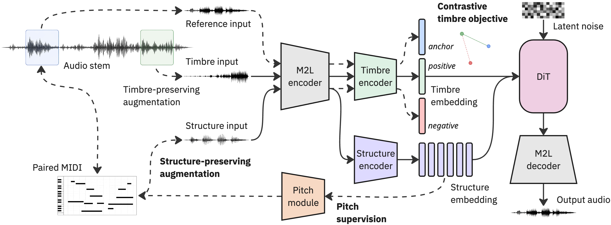

# Music Latent Disentanglement (MLD)

Anonymous authors (paper currently under review)

## Overview

The project studies disentanglement in the latent space of a pretrained music autoencoder. The current codebase focuses on learning:

- `timbre` representations for one-shot transfer
- `structure` representations guided by symbolic musical information
- latent generators that support controllable decoding and reconstruction

The main training path uses:

- pretrained `music2latent` latents
- symbolic guidance from aligned `MIDI`
- structure and timbre augmentations
- timbre triplet supervision
- structure pitch supervision
- a `DiffusionTransformer1D` trained with a `RectifiedFlow` objective



## Current Scope

At the moment, this repository is intentionally focused and relatively minimal:

- one main latent codec path: `music2latent`
- one main generative path: `RectifiedFlow + DiffusionTransformer1D`
- dataset preparation, training, and notebook-based inference/reconstruction utilities

The current baseline configuration is centered around:

- `src/mld/pipeline/configs/base.gin`

## Installation

```bash
python -m venv venv
source venv/bin/activate
pip install -r requirements.txt
pip install -e .
```

## Dataset Preparation

Example command for preparing a latent dataset with MIDI supervision and augmentation banks:

```bash
python -m scripts.prepare_dataset \
    --input_dir /path/to/dataset \
    --output_dir ./experiments/dataset/mld_latents \
    --emb_model music2latent \
    --latents_only \
    --save_midi \
    --save_struct_aug_latent \
    --save_timbre_aug_latent
```

## Training

Example training command:

```bash
python -m scripts.train \
    --dataset_path ./experiments/dataset/mld_latents \
    --config base.gin \
    --name mld_baseline \
    --batch_size 128 \
    --learning_rate 1e-4 \
    --epochs 50
```

## Repository Layout

```text
src/mld/
  dataset/        dataset loading, parsing, MIDI utilities, augmentations
  pipeline/       models, networks, configs, training utilities
  autoencoder/    latent codec helpers
scripts/          dataset preparation and training entry points
experiments/      notebooks, outputs, and run artifacts
```

## Notes

- This README is intentionally concise for now and can be expanded later with fuller setup, evaluation, and inference details.
